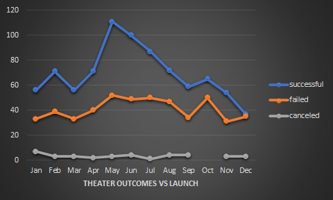
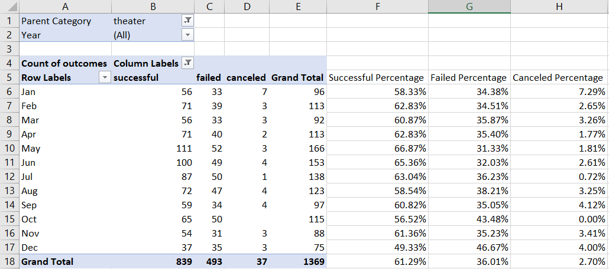
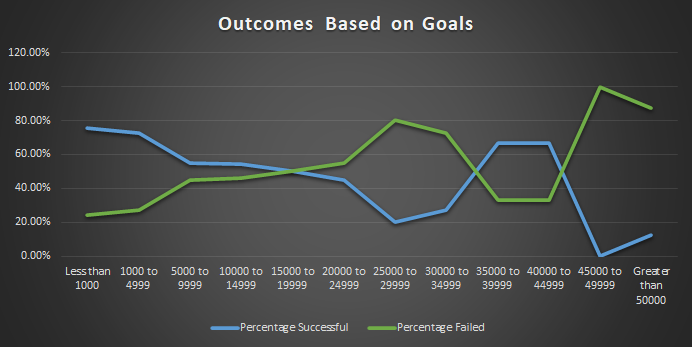
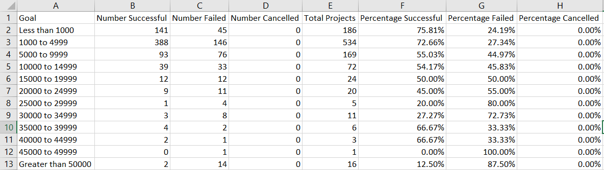

# Kickstarter-Analysis

## Overview of Project

At request of Louise, I have created graphs from the provided datasets in order to compare play-based kickstarter campaign outcomes based on their launch dates as well as goals set.

### Purpose

This analyzes was conducted for Louise in order to compare other play-based kickstarter campaigns, whether they suceeded or failed, based on their launch dates as well as their set fundraising goals.

## Analysis and Challenges

This analysis was performed by creating two tables, one for each deliverable requested.
The first, comparing the number of successful and failed play-based kickstarters by which month they launched in.
The second, comparing the percentage of successful and failed campaigns based on their initial set funding goals.

A challenge I faced while performing this analysis was organization. I had created the tables but the initial dataset was incorrectly organized and filtered, and thus threw off my results. After returning to the initial dataset and clearning previous set filters, I could apply the proper filters and thus create an accurate table for displaying the refined and filtered data.

### Analysis of Outcomes Based on Launch Date

Looking at our dataset of play-based campaigns and when they were launched, we notice almost immediately that the most amount of successful campaigns begin in the month of may, at an impressive 111 successes.

However, this large spike distracts us from the fact that May also has the highest amount of failed kickstarter campaigns, at 52 failed when launching that month.
Comparing these two statistics, we find that there is a 66.87% success rate for campaigns launched in May, which is still the highest success rate.

### Analysis of Outcomes Based on Goals

Looking at the tables created, comparing which campaigns were successful and which ones were failures by goal bracket, we find that smaller funding goals tend to lead to more successful campaigns than high set funding goals.

The ideal range for goal setting would be up to $5,000, as that boasts up to a 72.66% success rate comapared to higher set funding goals.
Going higher is possible, but not ideal as success margins drop drastically once crossing that $5,000 threshhold, down to 55.03% success rate if the goal is set between $5,000 and $10,000, with success rates dropping the higher the goal.

### Challenges and Difficulties Encountered

One difficulty that some might encounter would be valuing promising percentages that lean in your favour without considering that specific dataset size.
As an example, viewing our Outcomes based on Goals graph, we see that success rates are high when a campaign sets its funding goal anywhere between $35,000 and $45,000.
The success rate of 66.67% may not be true, as that dataset consists of a total of 9 campaigns.

With only 9 total campaigns placed within this bracket, it is difficult to measure if this is consistant or if there are outlying data points here.
More campaigns would need to happen within this bracket to obtain a conclusive answer.

## Results

- What are two conclusions you can draw about the Outcomes based on Launch Date?

When comparing other play-based kickstarter campaigns based on their launch date, there is significantly more campaigns started between the months of May to July than the other months.
These months boast the highest success rate of campaigns being funded, starting with May at a 66.87% successful funding to July, with its 63.04% successful funding. 

- What can you conclude about the Outcomes based on Goals?

Looking at our graph comparing Outcomes based on goals, we can see that smaller goals have a higher success rate.
Specifically, Up to $5,000 is a safe goal to set for funding, as it shows up to a 72.66% success rate amongst all campaigns run.
Setting the funding goals higher leads to lower chances of success.

- What are some limitations of this dataset?

A limitation of this dataset would be that there are very few campaigns run with higher funding goals, and that the higher the goal, the less campaigns we have data to compare to exist.
More campaigns run within our higher set brackets would increase accuracy in success/failure rates for these campaigns.

- What are some other possible tables and/or graphs that we could create?

Two tables that would provide valuable information would be one that compare successful and failed campaigns that were staff picked versus ones that were not, and another which compared number of backers to the goals.
The first table would allow us to filter further through our options, and see how having a campaign be staff picked affects success.
The second suggested table would allow us to filter through outliers, as it allows us to see which productions were actually wanted by the people versus which ones were funded by a single entity/group, allowing us to determine its expected popularity once produced.
